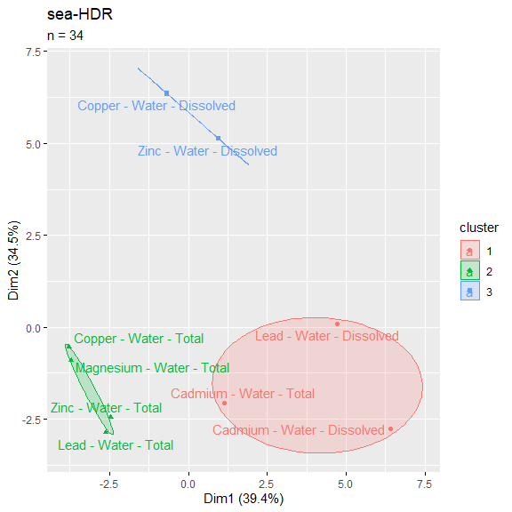
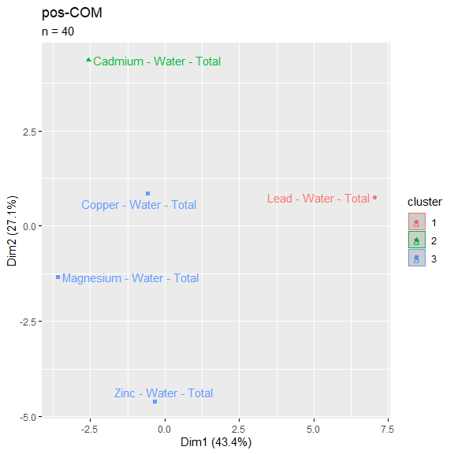
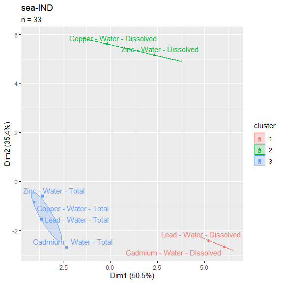
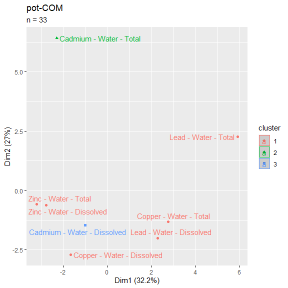
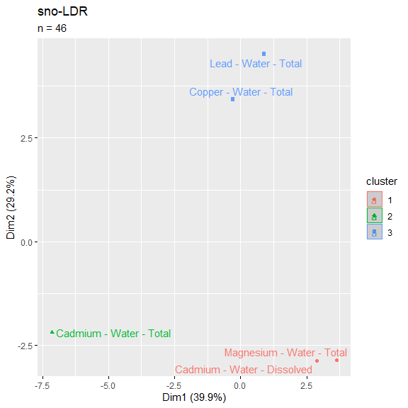
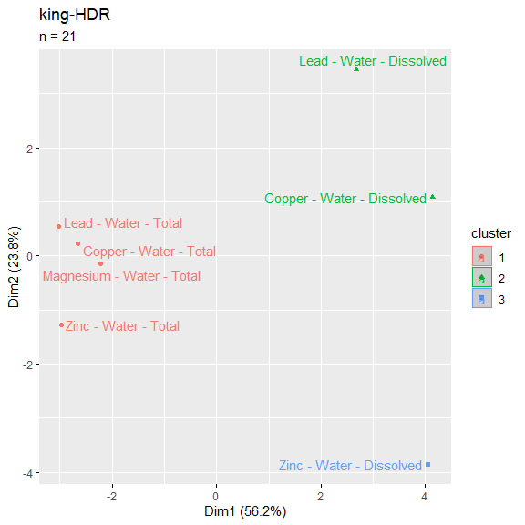
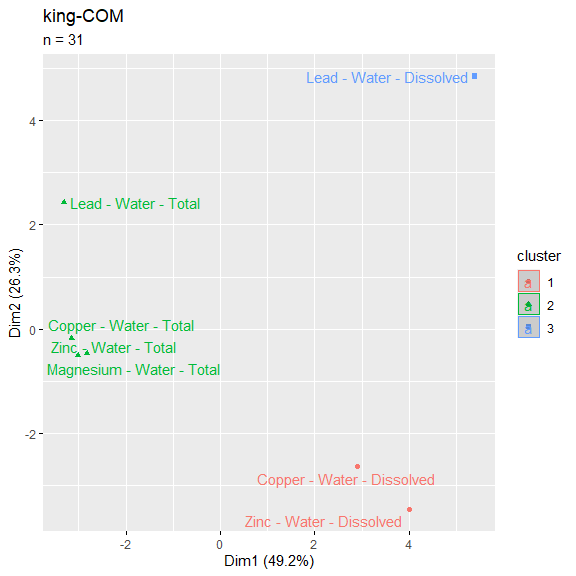
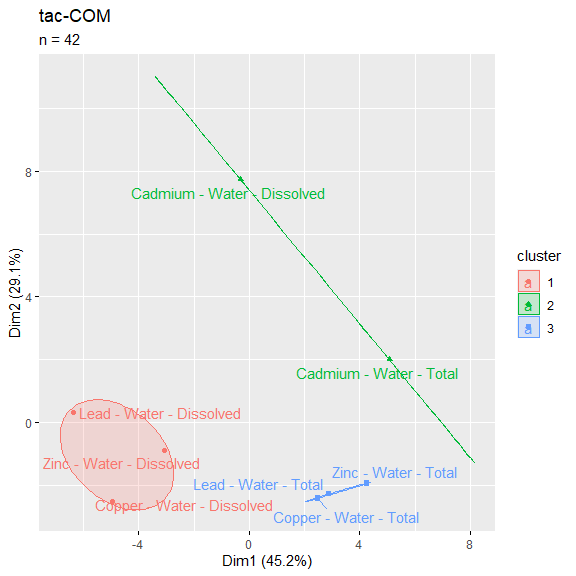
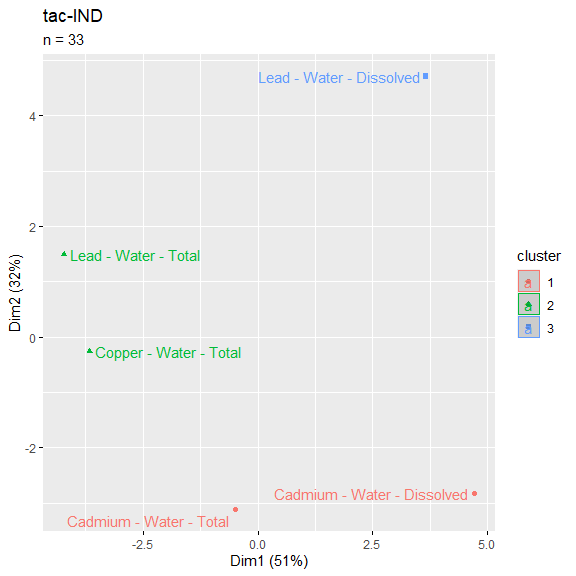
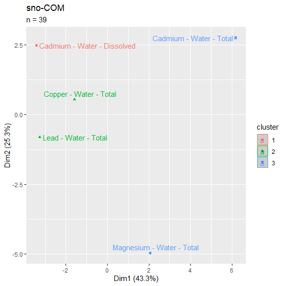

Outfall Data- kMeans clusters
================

    Warning: package 'rlist' was built under R version 4.0.5

<table class=" lightable-classic" style="font-family: &quot;Arial Narrow&quot;, &quot;Source Sans Pro&quot;, sans-serif; width: auto !important; margin-left: auto; margin-right: auto;">
<thead>
<tr>
<th style="text-align:left;">
parameter
</th>
<th style="text-align:right;">
sea-COM
</th>
<th style="text-align:right;">
sea-HDR
</th>
<th style="text-align:right;">
pos-COM
</th>
<th style="text-align:right;">
sea-IND
</th>
<th style="text-align:right;">
pot-COM
</th>
<th style="text-align:right;">
pierce-COM
</th>
<th style="text-align:right;">
sno-LDR
</th>
<th style="text-align:right;">
sno-HDR
</th>
<th style="text-align:right;">
king-HDR
</th>
<th style="text-align:right;">
tac-HDR
</th>
<th style="text-align:right;">
king-COM
</th>
<th style="text-align:right;">
tac-COM
</th>
<th style="text-align:right;">
tac-IND
</th>
<th style="text-align:right;">
sno-COM
</th>
<th style="text-align:right;">
pierce-LDR
</th>
<th style="text-align:right;">
pierce-HDR
</th>
<th style="text-align:right;">
king-LDR
</th>
</tr>
</thead>
<tbody>
<tr>
<td style="text-align:left;">
Calcium - Water - Total
</td>
<td style="text-align:right;">
33
</td>
<td style="text-align:right;">
34
</td>
<td style="text-align:right;">
49
</td>
<td style="text-align:right;">
32
</td>
<td style="text-align:right;">
NA
</td>
<td style="text-align:right;">
NA
</td>
<td style="text-align:right;">
46
</td>
<td style="text-align:right;">
38
</td>
<td style="text-align:right;">
21
</td>
<td style="text-align:right;">
NA
</td>
<td style="text-align:right;">
31
</td>
<td style="text-align:right;">
NA
</td>
<td style="text-align:right;">
NA
</td>
<td style="text-align:right;">
39
</td>
<td style="text-align:right;">
NA
</td>
<td style="text-align:right;">
NA
</td>
<td style="text-align:right;">
30
</td>
</tr>
<tr>
<td style="text-align:left;">
Copper - Water - Total
</td>
<td style="text-align:right;">
33
</td>
<td style="text-align:right;">
34
</td>
<td style="text-align:right;">
49
</td>
<td style="text-align:right;">
33
</td>
<td style="text-align:right;">
33
</td>
<td style="text-align:right;">
28
</td>
<td style="text-align:right;">
46
</td>
<td style="text-align:right;">
38
</td>
<td style="text-align:right;">
21
</td>
<td style="text-align:right;">
51
</td>
<td style="text-align:right;">
31
</td>
<td style="text-align:right;">
42
</td>
<td style="text-align:right;">
33
</td>
<td style="text-align:right;">
39
</td>
<td style="text-align:right;">
23
</td>
<td style="text-align:right;">
15
</td>
<td style="text-align:right;">
30
</td>
</tr>
<tr>
<td style="text-align:left;">
Copper - Water - Dissolved
</td>
<td style="text-align:right;">
33
</td>
<td style="text-align:right;">
34
</td>
<td style="text-align:right;">
46
</td>
<td style="text-align:right;">
33
</td>
<td style="text-align:right;">
33
</td>
<td style="text-align:right;">
22
</td>
<td style="text-align:right;">
33
</td>
<td style="text-align:right;">
27
</td>
<td style="text-align:right;">
21
</td>
<td style="text-align:right;">
47
</td>
<td style="text-align:right;">
31
</td>
<td style="text-align:right;">
42
</td>
<td style="text-align:right;">
32
</td>
<td style="text-align:right;">
33
</td>
<td style="text-align:right;">
15
</td>
<td style="text-align:right;">
8
</td>
<td style="text-align:right;">
30
</td>
</tr>
<tr>
<td style="text-align:left;">
Cadmium - Water - Total
</td>
<td style="text-align:right;">
33
</td>
<td style="text-align:right;">
34
</td>
<td style="text-align:right;">
49
</td>
<td style="text-align:right;">
33
</td>
<td style="text-align:right;">
33
</td>
<td style="text-align:right;">
22
</td>
<td style="text-align:right;">
46
</td>
<td style="text-align:right;">
38
</td>
<td style="text-align:right;">
20
</td>
<td style="text-align:right;">
52
</td>
<td style="text-align:right;">
30
</td>
<td style="text-align:right;">
42
</td>
<td style="text-align:right;">
33
</td>
<td style="text-align:right;">
39
</td>
<td style="text-align:right;">
15
</td>
<td style="text-align:right;">
8
</td>
<td style="text-align:right;">
30
</td>
</tr>
<tr>
<td style="text-align:left;">
Cadmium - Water - Dissolved
</td>
<td style="text-align:right;">
33
</td>
<td style="text-align:right;">
34
</td>
<td style="text-align:right;">
46
</td>
<td style="text-align:right;">
33
</td>
<td style="text-align:right;">
33
</td>
<td style="text-align:right;">
22
</td>
<td style="text-align:right;">
46
</td>
<td style="text-align:right;">
37
</td>
<td style="text-align:right;">
20
</td>
<td style="text-align:right;">
52
</td>
<td style="text-align:right;">
30
</td>
<td style="text-align:right;">
42
</td>
<td style="text-align:right;">
33
</td>
<td style="text-align:right;">
39
</td>
<td style="text-align:right;">
15
</td>
<td style="text-align:right;">
8
</td>
<td style="text-align:right;">
30
</td>
</tr>
<tr>
<td style="text-align:left;">
Lead - Water - Dissolved
</td>
<td style="text-align:right;">
33
</td>
<td style="text-align:right;">
34
</td>
<td style="text-align:right;">
46
</td>
<td style="text-align:right;">
33
</td>
<td style="text-align:right;">
33
</td>
<td style="text-align:right;">
22
</td>
<td style="text-align:right;">
40
</td>
<td style="text-align:right;">
36
</td>
<td style="text-align:right;">
21
</td>
<td style="text-align:right;">
52
</td>
<td style="text-align:right;">
31
</td>
<td style="text-align:right;">
42
</td>
<td style="text-align:right;">
33
</td>
<td style="text-align:right;">
37
</td>
<td style="text-align:right;">
15
</td>
<td style="text-align:right;">
8
</td>
<td style="text-align:right;">
30
</td>
</tr>
<tr>
<td style="text-align:left;">
Magnesium - Water - Total
</td>
<td style="text-align:right;">
33
</td>
<td style="text-align:right;">
34
</td>
<td style="text-align:right;">
49
</td>
<td style="text-align:right;">
32
</td>
<td style="text-align:right;">
NA
</td>
<td style="text-align:right;">
NA
</td>
<td style="text-align:right;">
46
</td>
<td style="text-align:right;">
38
</td>
<td style="text-align:right;">
21
</td>
<td style="text-align:right;">
NA
</td>
<td style="text-align:right;">
31
</td>
<td style="text-align:right;">
NA
</td>
<td style="text-align:right;">
NA
</td>
<td style="text-align:right;">
39
</td>
<td style="text-align:right;">
NA
</td>
<td style="text-align:right;">
NA
</td>
<td style="text-align:right;">
30
</td>
</tr>
<tr>
<td style="text-align:left;">
Zinc - Water - Total
</td>
<td style="text-align:right;">
34
</td>
<td style="text-align:right;">
34
</td>
<td style="text-align:right;">
49
</td>
<td style="text-align:right;">
33
</td>
<td style="text-align:right;">
33
</td>
<td style="text-align:right;">
22
</td>
<td style="text-align:right;">
45
</td>
<td style="text-align:right;">
36
</td>
<td style="text-align:right;">
21
</td>
<td style="text-align:right;">
52
</td>
<td style="text-align:right;">
31
</td>
<td style="text-align:right;">
42
</td>
<td style="text-align:right;">
32
</td>
<td style="text-align:right;">
37
</td>
<td style="text-align:right;">
15
</td>
<td style="text-align:right;">
8
</td>
<td style="text-align:right;">
30
</td>
</tr>
<tr>
<td style="text-align:left;">
Zinc - Water - Dissolved
</td>
<td style="text-align:right;">
34
</td>
<td style="text-align:right;">
34
</td>
<td style="text-align:right;">
46
</td>
<td style="text-align:right;">
33
</td>
<td style="text-align:right;">
33
</td>
<td style="text-align:right;">
22
</td>
<td style="text-align:right;">
39
</td>
<td style="text-align:right;">
29
</td>
<td style="text-align:right;">
21
</td>
<td style="text-align:right;">
52
</td>
<td style="text-align:right;">
31
</td>
<td style="text-align:right;">
42
</td>
<td style="text-align:right;">
32
</td>
<td style="text-align:right;">
37
</td>
<td style="text-align:right;">
15
</td>
<td style="text-align:right;">
8
</td>
<td style="text-align:right;">
30
</td>
</tr>
<tr>
<td style="text-align:left;">
Mercury - Water - Total
</td>
<td style="text-align:right;">
34
</td>
<td style="text-align:right;">
1
</td>
<td style="text-align:right;">
49
</td>
<td style="text-align:right;">
33
</td>
<td style="text-align:right;">
33
</td>
<td style="text-align:right;">
22
</td>
<td style="text-align:right;">
6
</td>
<td style="text-align:right;">
5
</td>
<td style="text-align:right;">
8
</td>
<td style="text-align:right;">
52
</td>
<td style="text-align:right;">
30
</td>
<td style="text-align:right;">
42
</td>
<td style="text-align:right;">
33
</td>
<td style="text-align:right;">
37
</td>
<td style="text-align:right;">
15
</td>
<td style="text-align:right;">
8
</td>
<td style="text-align:right;">
13
</td>
</tr>
<tr>
<td style="text-align:left;">
Mercury - Water - Dissolved
</td>
<td style="text-align:right;">
34
</td>
<td style="text-align:right;">
1
</td>
<td style="text-align:right;">
38
</td>
<td style="text-align:right;">
33
</td>
<td style="text-align:right;">
33
</td>
<td style="text-align:right;">
22
</td>
<td style="text-align:right;">
6
</td>
<td style="text-align:right;">
5
</td>
<td style="text-align:right;">
8
</td>
<td style="text-align:right;">
52
</td>
<td style="text-align:right;">
30
</td>
<td style="text-align:right;">
42
</td>
<td style="text-align:right;">
33
</td>
<td style="text-align:right;">
37
</td>
<td style="text-align:right;">
15
</td>
<td style="text-align:right;">
8
</td>
<td style="text-align:right;">
13
</td>
</tr>
<tr>
<td style="text-align:left;">
Lead - Water - Total
</td>
<td style="text-align:right;">
34
</td>
<td style="text-align:right;">
34
</td>
<td style="text-align:right;">
49
</td>
<td style="text-align:right;">
33
</td>
<td style="text-align:right;">
33
</td>
<td style="text-align:right;">
22
</td>
<td style="text-align:right;">
46
</td>
<td style="text-align:right;">
37
</td>
<td style="text-align:right;">
21
</td>
<td style="text-align:right;">
51
</td>
<td style="text-align:right;">
31
</td>
<td style="text-align:right;">
42
</td>
<td style="text-align:right;">
33
</td>
<td style="text-align:right;">
39
</td>
<td style="text-align:right;">
15
</td>
<td style="text-align:right;">
8
</td>
<td style="text-align:right;">
30
</td>
</tr>
<tr>
<td style="text-align:left;">
Magnesium - Water - Dissolved
</td>
<td style="text-align:right;">
NA
</td>
<td style="text-align:right;">
NA
</td>
<td style="text-align:right;">
2
</td>
<td style="text-align:right;">
NA
</td>
<td style="text-align:right;">
NA
</td>
<td style="text-align:right;">
NA
</td>
<td style="text-align:right;">
NA
</td>
<td style="text-align:right;">
NA
</td>
<td style="text-align:right;">
NA
</td>
<td style="text-align:right;">
NA
</td>
<td style="text-align:right;">
NA
</td>
<td style="text-align:right;">
NA
</td>
<td style="text-align:right;">
NA
</td>
<td style="text-align:right;">
NA
</td>
<td style="text-align:right;">
NA
</td>
<td style="text-align:right;">
NA
</td>
<td style="text-align:right;">
NA
</td>
</tr>
<tr>
<td style="text-align:left;">
Arsenic - Water - Dissolved
</td>
<td style="text-align:right;">
NA
</td>
<td style="text-align:right;">
NA
</td>
<td style="text-align:right;">
NA
</td>
<td style="text-align:right;">
NA
</td>
<td style="text-align:right;">
NA
</td>
<td style="text-align:right;">
NA
</td>
<td style="text-align:right;">
NA
</td>
<td style="text-align:right;">
NA
</td>
<td style="text-align:right;">
NA
</td>
<td style="text-align:right;">
NA
</td>
<td style="text-align:right;">
1
</td>
<td style="text-align:right;">
NA
</td>
<td style="text-align:right;">
NA
</td>
<td style="text-align:right;">
NA
</td>
<td style="text-align:right;">
NA
</td>
<td style="text-align:right;">
NA
</td>
<td style="text-align:right;">
15
</td>
</tr>
<tr>
<td style="text-align:left;">
Calcium - Water - Dissolved
</td>
<td style="text-align:right;">
NA
</td>
<td style="text-align:right;">
NA
</td>
<td style="text-align:right;">
2
</td>
<td style="text-align:right;">
NA
</td>
<td style="text-align:right;">
NA
</td>
<td style="text-align:right;">
NA
</td>
<td style="text-align:right;">
NA
</td>
<td style="text-align:right;">
NA
</td>
<td style="text-align:right;">
NA
</td>
<td style="text-align:right;">
NA
</td>
<td style="text-align:right;">
NA
</td>
<td style="text-align:right;">
NA
</td>
<td style="text-align:right;">
NA
</td>
<td style="text-align:right;">
NA
</td>
<td style="text-align:right;">
NA
</td>
<td style="text-align:right;">
NA
</td>
<td style="text-align:right;">
NA
</td>
</tr>
</tbody>
</table>

<!-- -->

    Warning: Computation failed in `stat_conf_ellipse()`:
    missing value where TRUE/FALSE needed

<!-- --><!-- -->

    Warning: Computation failed in `stat_conf_ellipse()`:
    missing value where TRUE/FALSE needed

<!-- -->

    Warning: Computation failed in `stat_conf_ellipse()`:
    missing value where TRUE/FALSE needed

<!-- -->

    Warning: Computation failed in `stat_conf_ellipse()`:
    missing value where TRUE/FALSE needed

<!-- -->

    Warning: Computation failed in `stat_conf_ellipse()`:
    missing value where TRUE/FALSE needed

<!-- -->

    Warning: Computation failed in `stat_conf_ellipse()`:
    missing value where TRUE/FALSE needed

<!-- --><!-- -->

    Warning: Computation failed in `stat_conf_ellipse()`:
    missing value where TRUE/FALSE needed

<!-- -->

    Warning: Computation failed in `stat_conf_ellipse()`:
    missing value where TRUE/FALSE needed

<!-- -->
