Outfall Data- kMeans clusters
================

<table class=" lightable-classic" style="font-family: &quot;Arial Narrow&quot;, &quot;Source Sans Pro&quot;, sans-serif; width: auto !important; margin-left: auto; margin-right: auto;">
<caption>
Number of sampling events
</caption>
<thead>
<tr>
<th style="text-align:left;">
parameter
</th>
<th style="text-align:right;">
sea-HDR
</th>
<th style="text-align:right;">
sea-COM
</th>
<th style="text-align:right;">
sea-IND
</th>
<th style="text-align:right;">
pos-COM
</th>
<th style="text-align:right;">
tac-COM
</th>
<th style="text-align:right;">
pot-COM
</th>
<th style="text-align:right;">
sno-LDR
</th>
<th style="text-align:right;">
sno-HDR
</th>
<th style="text-align:right;">
king-HDR
</th>
<th style="text-align:right;">
king-LDR
</th>
<th style="text-align:right;">
tac-HDR
</th>
<th style="text-align:right;">
king-COM
</th>
<th style="text-align:right;">
tac-IND
</th>
<th style="text-align:right;">
sno-COM
</th>
</tr>
</thead>
<tbody>
<tr>
<td style="text-align:left;">
Total Suspended Solids - Water - Total
</td>
<td style="text-align:right;">
34
</td>
<td style="text-align:right;">
32
</td>
<td style="text-align:right;">
32
</td>
<td style="text-align:right;">
49
</td>
<td style="text-align:right;">
38
</td>
<td style="text-align:right;">
33
</td>
<td style="text-align:right;">
40
</td>
<td style="text-align:right;">
33
</td>
<td style="text-align:right;">
21
</td>
<td style="text-align:right;">
30
</td>
<td style="text-align:right;">
48
</td>
<td style="text-align:right;">
31
</td>
<td style="text-align:right;">
30
</td>
<td style="text-align:right;">
32
</td>
</tr>
<tr>
<td style="text-align:left;">
Copper - Water - Total
</td>
<td style="text-align:right;">
34
</td>
<td style="text-align:right;">
33
</td>
<td style="text-align:right;">
33
</td>
<td style="text-align:right;">
49
</td>
<td style="text-align:right;">
42
</td>
<td style="text-align:right;">
33
</td>
<td style="text-align:right;">
46
</td>
<td style="text-align:right;">
38
</td>
<td style="text-align:right;">
21
</td>
<td style="text-align:right;">
30
</td>
<td style="text-align:right;">
51
</td>
<td style="text-align:right;">
31
</td>
<td style="text-align:right;">
33
</td>
<td style="text-align:right;">
39
</td>
</tr>
<tr>
<td style="text-align:left;">
Turbidity - Water - Total
</td>
<td style="text-align:right;">
34
</td>
<td style="text-align:right;">
32
</td>
<td style="text-align:right;">
32
</td>
<td style="text-align:right;">
49
</td>
<td style="text-align:right;">
11
</td>
<td style="text-align:right;">
32
</td>
<td style="text-align:right;">
44
</td>
<td style="text-align:right;">
37
</td>
<td style="text-align:right;">
21
</td>
<td style="text-align:right;">
29
</td>
<td style="text-align:right;">
21
</td>
<td style="text-align:right;">
31
</td>
<td style="text-align:right;">
10
</td>
<td style="text-align:right;">
38
</td>
</tr>
<tr>
<td style="text-align:left;">
Copper - Water - Dissolved
</td>
<td style="text-align:right;">
34
</td>
<td style="text-align:right;">
33
</td>
<td style="text-align:right;">
33
</td>
<td style="text-align:right;">
46
</td>
<td style="text-align:right;">
42
</td>
<td style="text-align:right;">
33
</td>
<td style="text-align:right;">
33
</td>
<td style="text-align:right;">
27
</td>
<td style="text-align:right;">
21
</td>
<td style="text-align:right;">
30
</td>
<td style="text-align:right;">
47
</td>
<td style="text-align:right;">
31
</td>
<td style="text-align:right;">
32
</td>
<td style="text-align:right;">
33
</td>
</tr>
<tr>
<td style="text-align:left;">
Chloride - Water - Total
</td>
<td style="text-align:right;">
34
</td>
<td style="text-align:right;">
33
</td>
<td style="text-align:right;">
32
</td>
<td style="text-align:right;">
49
</td>
<td style="text-align:right;">
23
</td>
<td style="text-align:right;">
2
</td>
<td style="text-align:right;">
45
</td>
<td style="text-align:right;">
37
</td>
<td style="text-align:right;">
20
</td>
<td style="text-align:right;">
28
</td>
<td style="text-align:right;">
35
</td>
<td style="text-align:right;">
31
</td>
<td style="text-align:right;">
18
</td>
<td style="text-align:right;">
37
</td>
</tr>
<tr>
<td style="text-align:left;">
Conductivity - Water - Total
</td>
<td style="text-align:right;">
34
</td>
<td style="text-align:right;">
32
</td>
<td style="text-align:right;">
32
</td>
<td style="text-align:right;">
49
</td>
<td style="text-align:right;">
42
</td>
<td style="text-align:right;">
32
</td>
<td style="text-align:right;">
46
</td>
<td style="text-align:right;">
37
</td>
<td style="text-align:right;">
21
</td>
<td style="text-align:right;">
30
</td>
<td style="text-align:right;">
52
</td>
<td style="text-align:right;">
31
</td>
<td style="text-align:right;">
34
</td>
<td style="text-align:right;">
39
</td>
</tr>
<tr>
<td style="text-align:left;">
Zinc - Water - Total
</td>
<td style="text-align:right;">
34
</td>
<td style="text-align:right;">
34
</td>
<td style="text-align:right;">
33
</td>
<td style="text-align:right;">
49
</td>
<td style="text-align:right;">
42
</td>
<td style="text-align:right;">
33
</td>
<td style="text-align:right;">
45
</td>
<td style="text-align:right;">
36
</td>
<td style="text-align:right;">
21
</td>
<td style="text-align:right;">
30
</td>
<td style="text-align:right;">
52
</td>
<td style="text-align:right;">
31
</td>
<td style="text-align:right;">
32
</td>
<td style="text-align:right;">
37
</td>
</tr>
<tr>
<td style="text-align:left;">
Zinc - Water - Dissolved
</td>
<td style="text-align:right;">
34
</td>
<td style="text-align:right;">
34
</td>
<td style="text-align:right;">
33
</td>
<td style="text-align:right;">
46
</td>
<td style="text-align:right;">
42
</td>
<td style="text-align:right;">
33
</td>
<td style="text-align:right;">
39
</td>
<td style="text-align:right;">
29
</td>
<td style="text-align:right;">
21
</td>
<td style="text-align:right;">
30
</td>
<td style="text-align:right;">
52
</td>
<td style="text-align:right;">
31
</td>
<td style="text-align:right;">
32
</td>
<td style="text-align:right;">
37
</td>
</tr>
<tr>
<td style="text-align:left;">
Hardness as CaCO3 - Water - Total
</td>
<td style="text-align:right;">
34
</td>
<td style="text-align:right;">
33
</td>
<td style="text-align:right;">
32
</td>
<td style="text-align:right;">
10
</td>
<td style="text-align:right;">
42
</td>
<td style="text-align:right;">
NA
</td>
<td style="text-align:right;">
46
</td>
<td style="text-align:right;">
38
</td>
<td style="text-align:right;">
NA
</td>
<td style="text-align:right;">
NA
</td>
<td style="text-align:right;">
52
</td>
<td style="text-align:right;">
NA
</td>
<td style="text-align:right;">
33
</td>
<td style="text-align:right;">
39
</td>
</tr>
<tr>
<td style="text-align:left;">
Lead - Water - Total
</td>
<td style="text-align:right;">
34
</td>
<td style="text-align:right;">
34
</td>
<td style="text-align:right;">
33
</td>
<td style="text-align:right;">
49
</td>
<td style="text-align:right;">
42
</td>
<td style="text-align:right;">
33
</td>
<td style="text-align:right;">
46
</td>
<td style="text-align:right;">
37
</td>
<td style="text-align:right;">
21
</td>
<td style="text-align:right;">
30
</td>
<td style="text-align:right;">
51
</td>
<td style="text-align:right;">
31
</td>
<td style="text-align:right;">
33
</td>
<td style="text-align:right;">
39
</td>
</tr>
</tbody>
</table>

    `summarise()` has grouped output by 'site_name'. You can override using the `.groups` argument.

    Warning: `funs()` was deprecated in dplyr 0.8.0.
    Please use a list of either functions or lambdas: 

      # Simple named list: 
      list(mean = mean, median = median)

      # Auto named with `tibble::lst()`: 
      tibble::lst(mean, median)

      # Using lambdas
      list(~ mean(., trim = .2), ~ median(., na.rm = TRUE))

<table class=" lightable-classic" style="font-family: serif; margin-left: auto; margin-right: auto;">
<caption>
percent-nondetects summary
</caption>
<thead>
<tr>
<th style="text-align:left;">
parameter
</th>
<th style="text-align:left;">
king-COM
</th>
<th style="text-align:left;">
king-HDR
</th>
<th style="text-align:left;">
king-LDR
</th>
<th style="text-align:left;">
pos-COM
</th>
<th style="text-align:left;">
pot-COM
</th>
<th style="text-align:left;">
sea-COM
</th>
<th style="text-align:left;">
sea-HDR
</th>
<th style="text-align:left;">
sea-IND
</th>
<th style="text-align:left;">
sno-COM
</th>
<th style="text-align:left;">
sno-HDR
</th>
<th style="text-align:left;">
sno-LDR
</th>
<th style="text-align:left;">
tac-COM
</th>
<th style="text-align:left;">
tac-HDR
</th>
<th style="text-align:left;">
tac-IND
</th>
</tr>
</thead>
<tbody>
<tr>
<td style="text-align:left;">
Chloride - Water - Total
</td>
<td style="text-align:left;">
0%
</td>
<td style="text-align:left;">
0%
</td>
<td style="text-align:left;">
0%
</td>
<td style="text-align:left;">
0%
</td>
<td style="text-align:left;">
0%
</td>
<td style="text-align:left;">
0%
</td>
<td style="text-align:left;">
0%
</td>
<td style="text-align:left;">
0%
</td>
<td style="text-align:left;">
5%
</td>
<td style="text-align:left;">
22%
</td>
<td style="text-align:left;">
2%
</td>
<td style="text-align:left;">
0%
</td>
<td style="text-align:left;">
0%
</td>
<td style="text-align:left;">
0%
</td>
</tr>
<tr>
<td style="text-align:left;">
Conductivity - Water - Total
</td>
<td style="text-align:left;">
0%
</td>
<td style="text-align:left;">
0%
</td>
<td style="text-align:left;">
0%
</td>
<td style="text-align:left;">
0%
</td>
<td style="text-align:left;">
3%
</td>
<td style="text-align:left;">
0%
</td>
<td style="text-align:left;">
0%
</td>
<td style="text-align:left;">
0%
</td>
<td style="text-align:left;">
NA%
</td>
<td style="text-align:left;">
0%
</td>
<td style="text-align:left;">
0%
</td>
<td style="text-align:left;">
0%
</td>
<td style="text-align:left;">
0%
</td>
<td style="text-align:left;">
0%
</td>
</tr>
<tr>
<td style="text-align:left;">
Copper - Water - Dissolved
</td>
<td style="text-align:left;">
0%
</td>
<td style="text-align:left;">
0%
</td>
<td style="text-align:left;">
3%
</td>
<td style="text-align:left;">
2%
</td>
<td style="text-align:left;">
0%
</td>
<td style="text-align:left;">
0%
</td>
<td style="text-align:left;">
0%
</td>
<td style="text-align:left;">
0%
</td>
<td style="text-align:left;">
0%
</td>
<td style="text-align:left;">
15%
</td>
<td style="text-align:left;">
3%
</td>
<td style="text-align:left;">
2%
</td>
<td style="text-align:left;">
4%
</td>
<td style="text-align:left;">
3%
</td>
</tr>
<tr>
<td style="text-align:left;">
Copper - Water - Total
</td>
<td style="text-align:left;">
0%
</td>
<td style="text-align:left;">
0%
</td>
<td style="text-align:left;">
0%
</td>
<td style="text-align:left;">
0%
</td>
<td style="text-align:left;">
0%
</td>
<td style="text-align:left;">
0%
</td>
<td style="text-align:left;">
0%
</td>
<td style="text-align:left;">
0%
</td>
<td style="text-align:left;">
NA%
</td>
<td style="text-align:left;">
NA%
</td>
<td style="text-align:left;">
NA%
</td>
<td style="text-align:left;">
0%
</td>
<td style="text-align:left;">
0%
</td>
<td style="text-align:left;">
0%
</td>
</tr>
<tr>
<td style="text-align:left;">
Lead - Water - Total
</td>
<td style="text-align:left;">
0%
</td>
<td style="text-align:left;">
0%
</td>
<td style="text-align:left;">
0%
</td>
<td style="text-align:left;">
0%
</td>
<td style="text-align:left;">
0%
</td>
<td style="text-align:left;">
0%
</td>
<td style="text-align:left;">
0%
</td>
<td style="text-align:left;">
0%
</td>
<td style="text-align:left;">
NA%
</td>
<td style="text-align:left;">
11%
</td>
<td style="text-align:left;">
NA%
</td>
<td style="text-align:left;">
0%
</td>
<td style="text-align:left;">
0%
</td>
<td style="text-align:left;">
0%
</td>
</tr>
<tr>
<td style="text-align:left;">
Total Suspended Solids - Water - Total
</td>
<td style="text-align:left;">
0%
</td>
<td style="text-align:left;">
0%
</td>
<td style="text-align:left;">
7%
</td>
<td style="text-align:left;">
0%
</td>
<td style="text-align:left;">
0%
</td>
<td style="text-align:left;">
0%
</td>
<td style="text-align:left;">
0%
</td>
<td style="text-align:left;">
0%
</td>
<td style="text-align:left;">
NA%
</td>
<td style="text-align:left;">
NA%
</td>
<td style="text-align:left;">
NA%
</td>
<td style="text-align:left;">
0%
</td>
<td style="text-align:left;">
0%
</td>
<td style="text-align:left;">
0%
</td>
</tr>
<tr>
<td style="text-align:left;">
Turbidity - Water - Total
</td>
<td style="text-align:left;">
0%
</td>
<td style="text-align:left;">
0%
</td>
<td style="text-align:left;">
0%
</td>
<td style="text-align:left;">
0%
</td>
<td style="text-align:left;">
0%
</td>
<td style="text-align:left;">
0%
</td>
<td style="text-align:left;">
0%
</td>
<td style="text-align:left;">
0%
</td>
<td style="text-align:left;">
0%
</td>
<td style="text-align:left;">
0%
</td>
<td style="text-align:left;">
0%
</td>
<td style="text-align:left;">
0%
</td>
<td style="text-align:left;">
0%
</td>
<td style="text-align:left;">
0%
</td>
</tr>
<tr>
<td style="text-align:left;">
Zinc - Water - Dissolved
</td>
<td style="text-align:left;">
0%
</td>
<td style="text-align:left;">
0%
</td>
<td style="text-align:left;">
3%
</td>
<td style="text-align:left;">
0%
</td>
<td style="text-align:left;">
0%
</td>
<td style="text-align:left;">
0%
</td>
<td style="text-align:left;">
0%
</td>
<td style="text-align:left;">
0%
</td>
<td style="text-align:left;">
NA%
</td>
<td style="text-align:left;">
NA%
</td>
<td style="text-align:left;">
NA%
</td>
<td style="text-align:left;">
0%
</td>
<td style="text-align:left;">
2%
</td>
<td style="text-align:left;">
3%
</td>
</tr>
<tr>
<td style="text-align:left;">
Zinc - Water - Total
</td>
<td style="text-align:left;">
0%
</td>
<td style="text-align:left;">
0%
</td>
<td style="text-align:left;">
0%
</td>
<td style="text-align:left;">
0%
</td>
<td style="text-align:left;">
0%
</td>
<td style="text-align:left;">
0%
</td>
<td style="text-align:left;">
0%
</td>
<td style="text-align:left;">
0%
</td>
<td style="text-align:left;">
NA%
</td>
<td style="text-align:left;">
NA%
</td>
<td style="text-align:left;">
NA%
</td>
<td style="text-align:left;">
0%
</td>
<td style="text-align:left;">
0%
</td>
<td style="text-align:left;">
0%
</td>
</tr>
<tr>
<td style="text-align:left;">
Hardness as CaCO3 - Water - Total
</td>
<td style="text-align:left;">
NA%
</td>
<td style="text-align:left;">
NA%
</td>
<td style="text-align:left;">
NA%
</td>
<td style="text-align:left;">
0%
</td>
<td style="text-align:left;">
NA%
</td>
<td style="text-align:left;">
0%
</td>
<td style="text-align:left;">
0%
</td>
<td style="text-align:left;">
0%
</td>
<td style="text-align:left;">
0%
</td>
<td style="text-align:left;">
0%
</td>
<td style="text-align:left;">
0%
</td>
<td style="text-align:left;">
0%
</td>
<td style="text-align:left;">
0%
</td>
<td style="text-align:left;">
0%
</td>
</tr>
</tbody>
</table>

    ### sea-COM

    [1] "sea-HDR"

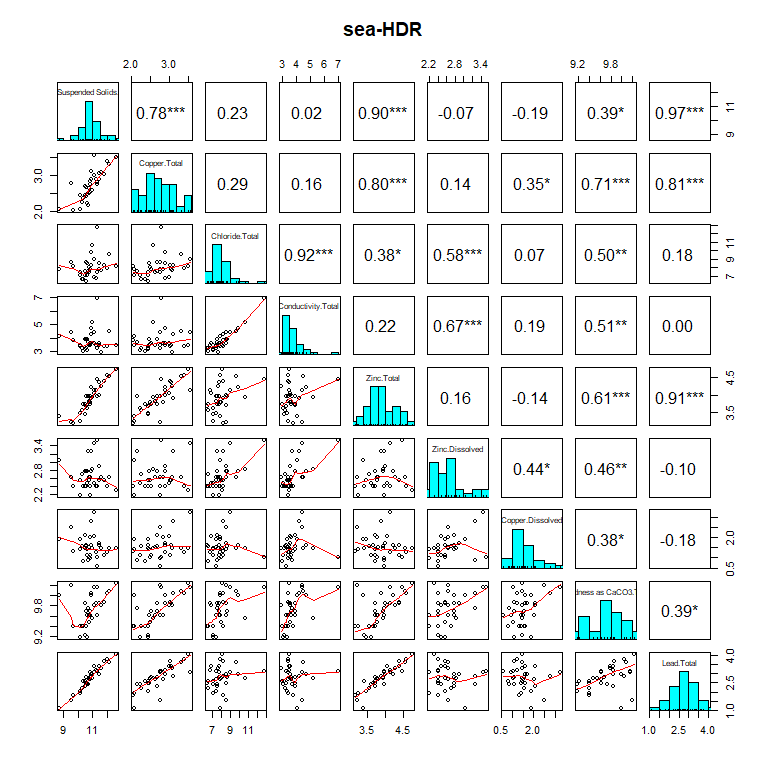<!-- -->

    $clusterPlot

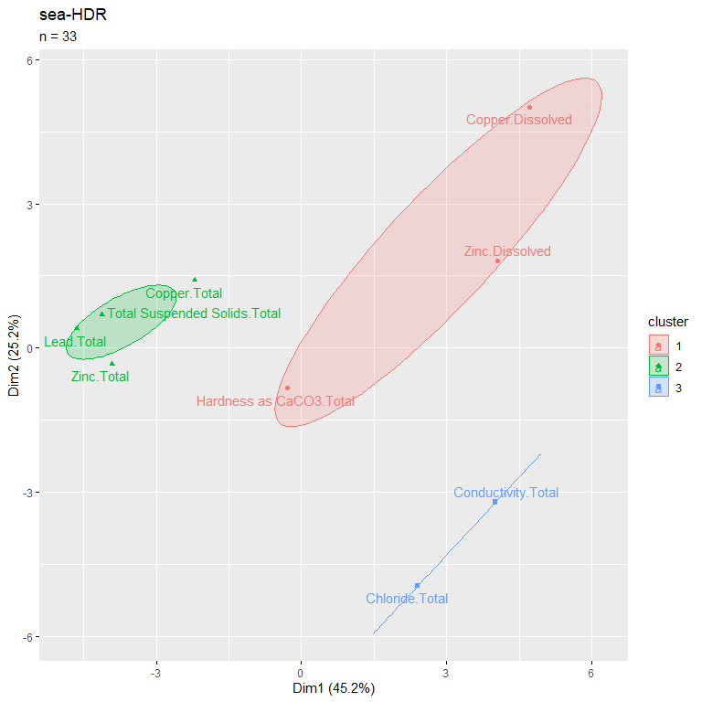<!-- -->

    $pairsplot
    NULL

    [1] "sea-COM"

<!-- -->

    $clusterPlot

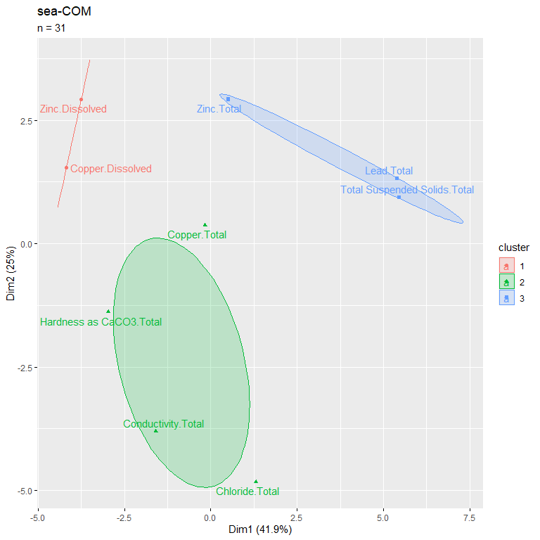<!-- -->

    $pairsplot
    NULL

    [1] "sea-IND"

<!-- -->

    $clusterPlot

<!-- -->

    $pairsplot
    NULL

    [1] "pos-COM"

<!-- -->

    $clusterPlot

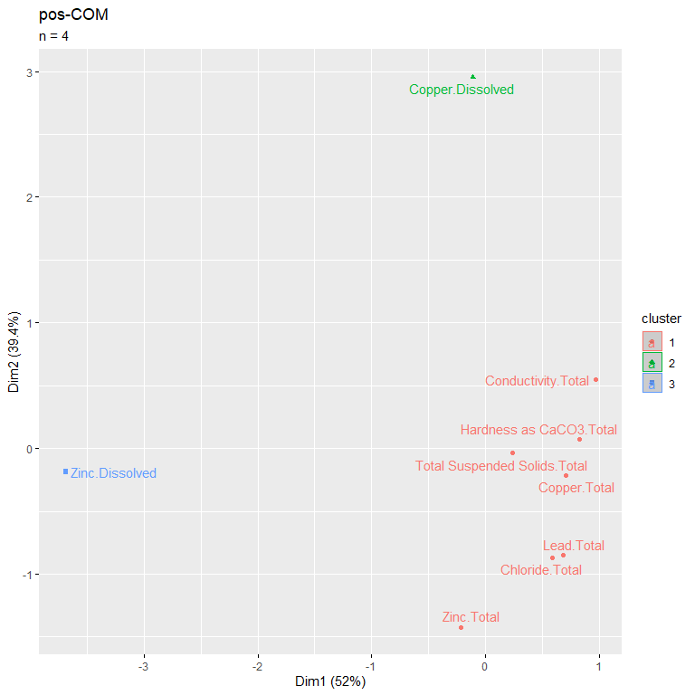<!-- -->

    $pairsplot
    NULL

    [1] "tac-COM"

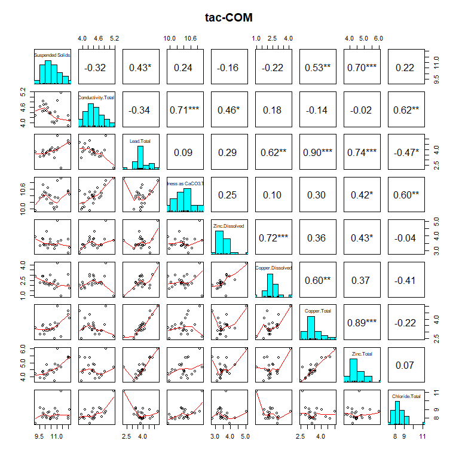<!-- -->

    $clusterPlot

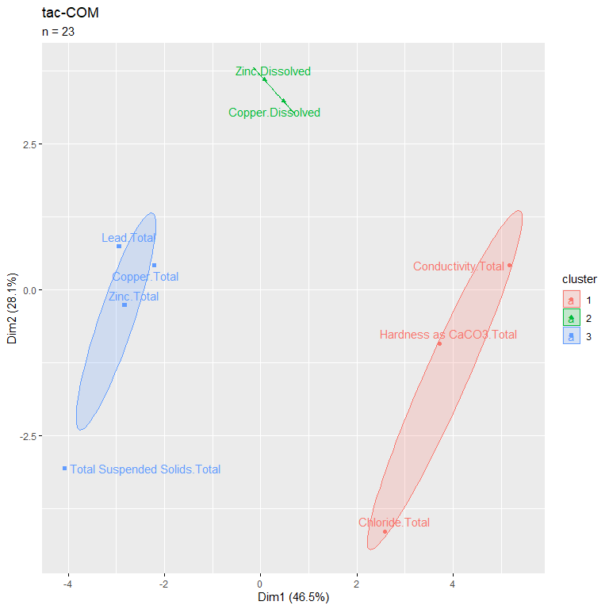<!-- -->

    $pairsplot
    NULL

    [1] "pot-COM"

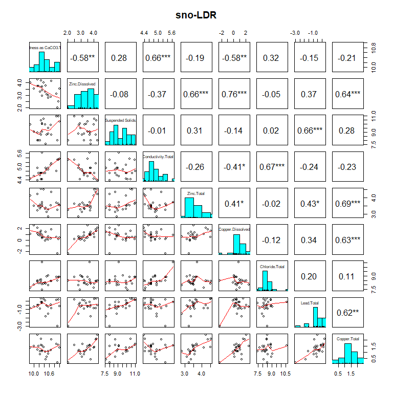<!-- -->

    $clusterPlot

<!-- -->

    $pairsplot
    NULL

    [1] "sno-LDR"

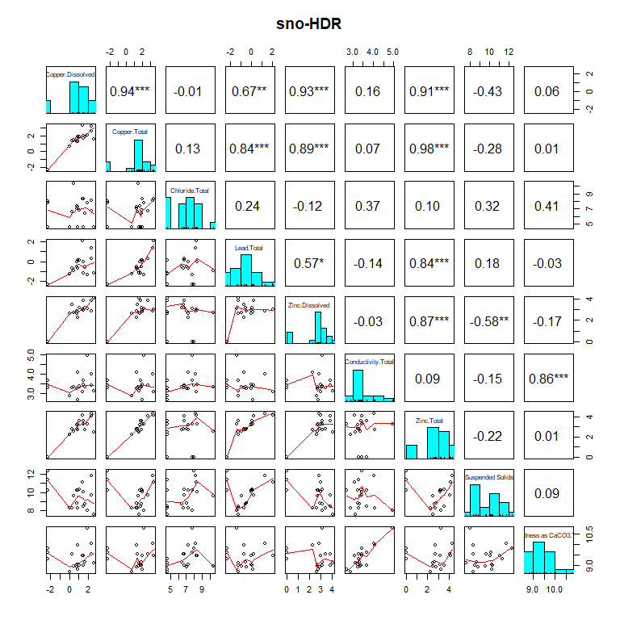<!-- -->

    $clusterPlot

<!-- -->

    $pairsplot
    NULL

    [1] "sno-HDR"

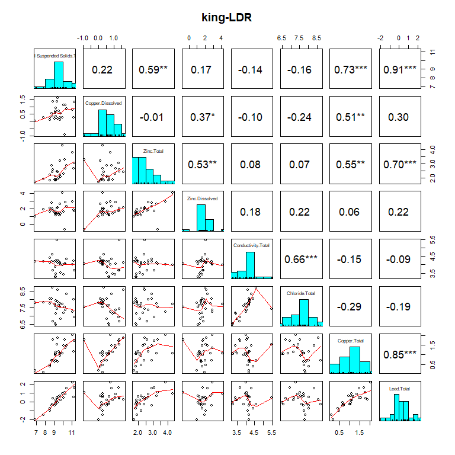<!-- -->

    $clusterPlot

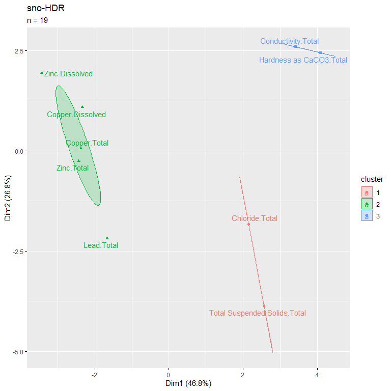<!-- -->

    $pairsplot
    NULL

    [1] "king-HDR"

<!-- -->

    $clusterPlot

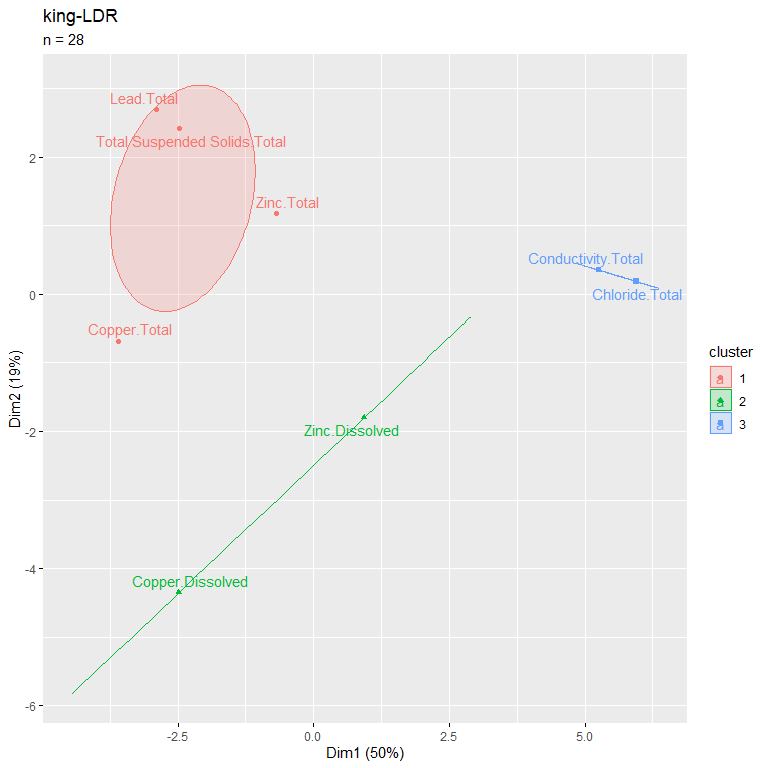<!-- -->

    $pairsplot
    NULL

    [1] "king-LDR"

<!-- -->

    $clusterPlot

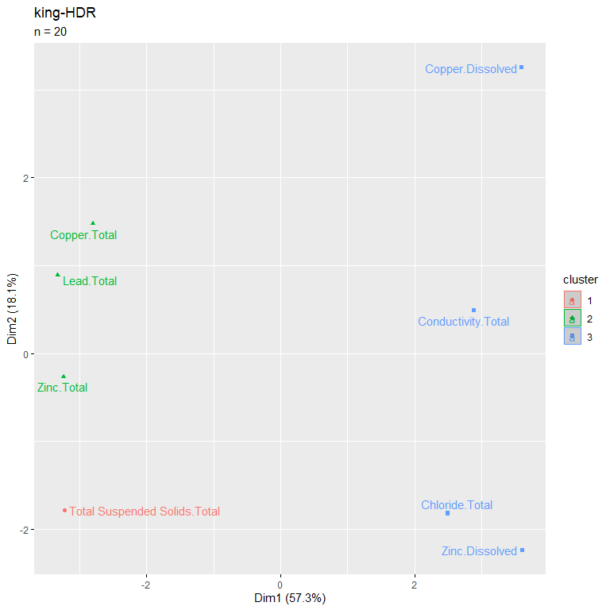<!-- -->

    $pairsplot
    NULL

    [1] "tac-HDR"

<!-- -->

    $clusterPlot

<!-- -->

    $pairsplot
    NULL

    [1] "king-COM"

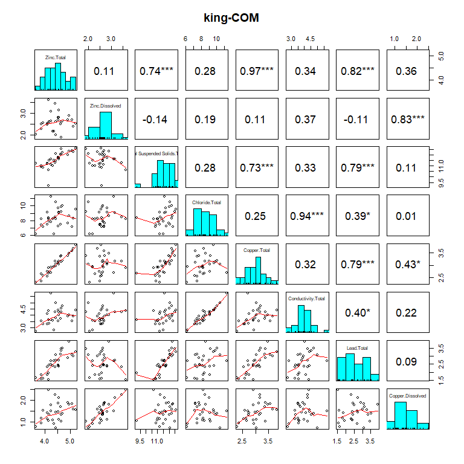<!-- -->

    $clusterPlot

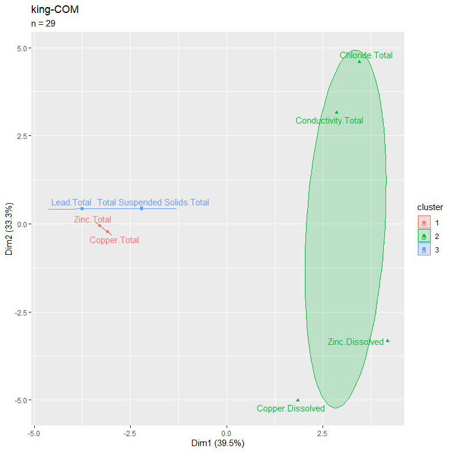<!-- -->

    $pairsplot
    NULL

    [1] "tac-IND"

<!-- -->

    $clusterPlot

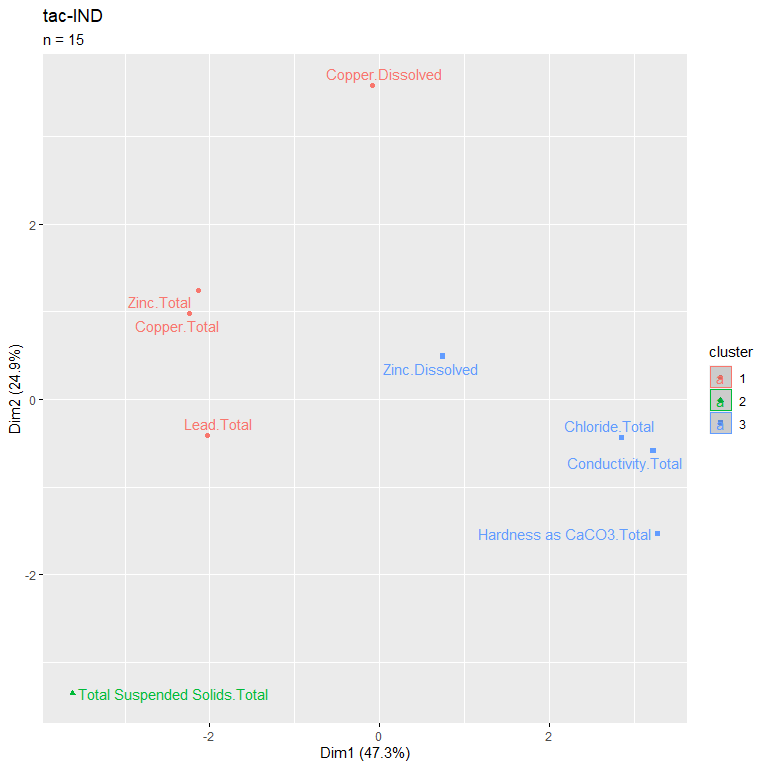<!-- -->

    $pairsplot
    NULL

    [1] "sno-COM"

<!-- -->

    $clusterPlot

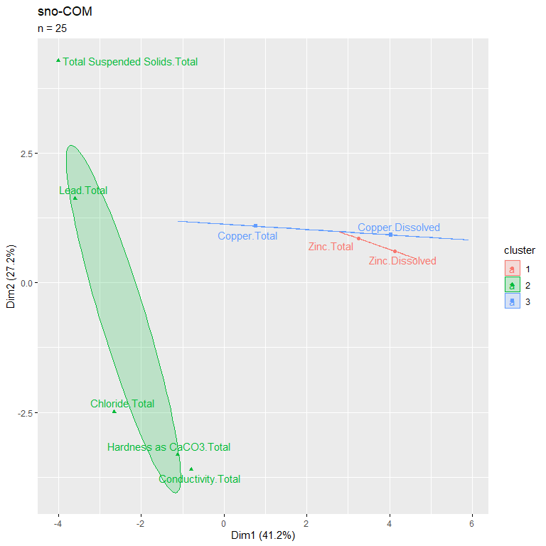<!-- -->

    $pairsplot
    NULL
