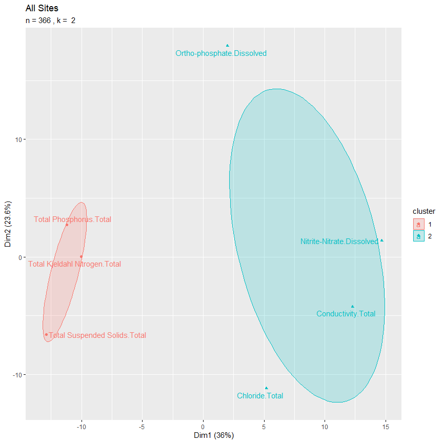
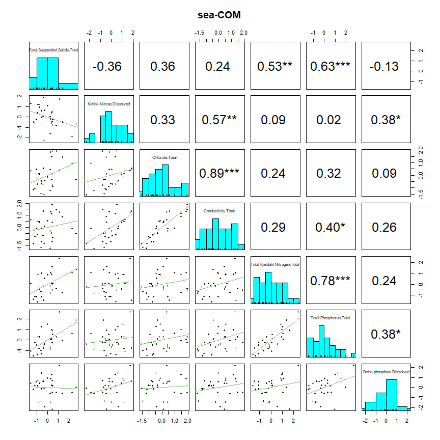

kMeans clusters, Nutrients
================

<table class=" lightable-classic" style="font-family: &quot;Arial Narrow&quot;, &quot;Source Sans Pro&quot;, sans-serif; width: auto !important; margin-left: auto; margin-right: auto;">
<caption>
Number of sampling events
</caption>
<thead>
<tr>
<th style="text-align:left;">
parameter
</th>
<th style="text-align:left;">
paramgroup
</th>
<th style="text-align:right;">
sea-HDR
</th>
<th style="text-align:right;">
sea-IND
</th>
<th style="text-align:right;">
pos-COM
</th>
<th style="text-align:right;">
sea-COM
</th>
<th style="text-align:right;">
tac-COM
</th>
<th style="text-align:right;">
king-LDR
</th>
<th style="text-align:right;">
sno-HDR
</th>
<th style="text-align:right;">
tac-IND
</th>
<th style="text-align:right;">
sno-LDR
</th>
<th style="text-align:right;">
king-COM
</th>
<th style="text-align:right;">
sno-COM
</th>
<th style="text-align:right;">
tac-HDR
</th>
<th style="text-align:right;">
pierce-COM
</th>
<th style="text-align:right;">
king-HDR
</th>
</tr>
</thead>
<tbody>
<tr>
<td style="text-align:left;">
Total Suspended Solids - Water - Total
</td>
<td style="text-align:left;">
Conventional
</td>
<td style="text-align:right;">
34
</td>
<td style="text-align:right;">
32
</td>
<td style="text-align:right;">
46
</td>
<td style="text-align:right;">
32
</td>
<td style="text-align:right;">
38
</td>
<td style="text-align:right;">
30
</td>
<td style="text-align:right;">
33
</td>
<td style="text-align:right;">
30
</td>
<td style="text-align:right;">
40
</td>
<td style="text-align:right;">
31
</td>
<td style="text-align:right;">
32
</td>
<td style="text-align:right;">
32
</td>
<td style="text-align:right;">
9
</td>
<td style="text-align:right;">
21
</td>
</tr>
<tr>
<td style="text-align:left;">
Nitrite-Nitrate - Water - Dissolved
</td>
<td style="text-align:left;">
Nutrient
</td>
<td style="text-align:right;">
34
</td>
<td style="text-align:right;">
32
</td>
<td style="text-align:right;">
40
</td>
<td style="text-align:right;">
32
</td>
<td style="text-align:right;">
24
</td>
<td style="text-align:right;">
30
</td>
<td style="text-align:right;">
37
</td>
<td style="text-align:right;">
20
</td>
<td style="text-align:right;">
46
</td>
<td style="text-align:right;">
31
</td>
<td style="text-align:right;">
38
</td>
<td style="text-align:right;">
30
</td>
<td style="text-align:right;">
8
</td>
<td style="text-align:right;">
21
</td>
</tr>
<tr>
<td style="text-align:left;">
Chloride - Water - Total
</td>
<td style="text-align:left;">
Conventional
</td>
<td style="text-align:right;">
33
</td>
<td style="text-align:right;">
32
</td>
<td style="text-align:right;">
46
</td>
<td style="text-align:right;">
33
</td>
<td style="text-align:right;">
23
</td>
<td style="text-align:right;">
28
</td>
<td style="text-align:right;">
37
</td>
<td style="text-align:right;">
17
</td>
<td style="text-align:right;">
45
</td>
<td style="text-align:right;">
29
</td>
<td style="text-align:right;">
37
</td>
<td style="text-align:right;">
25
</td>
<td style="text-align:right;">
8
</td>
<td style="text-align:right;">
20
</td>
</tr>
<tr>
<td style="text-align:left;">
Conductivity - Water - Total
</td>
<td style="text-align:left;">
Conventional
</td>
<td style="text-align:right;">
34
</td>
<td style="text-align:right;">
32
</td>
<td style="text-align:right;">
46
</td>
<td style="text-align:right;">
32
</td>
<td style="text-align:right;">
42
</td>
<td style="text-align:right;">
30
</td>
<td style="text-align:right;">
37
</td>
<td style="text-align:right;">
33
</td>
<td style="text-align:right;">
46
</td>
<td style="text-align:right;">
30
</td>
<td style="text-align:right;">
39
</td>
<td style="text-align:right;">
35
</td>
<td style="text-align:right;">
8
</td>
<td style="text-align:right;">
21
</td>
</tr>
<tr>
<td style="text-align:left;">
Total Kjeldahl Nitrogen - Water - Total
</td>
<td style="text-align:left;">
Nutrient
</td>
<td style="text-align:right;">
34
</td>
<td style="text-align:right;">
32
</td>
<td style="text-align:right;">
45
</td>
<td style="text-align:right;">
31
</td>
<td style="text-align:right;">
25
</td>
<td style="text-align:right;">
30
</td>
<td style="text-align:right;">
34
</td>
<td style="text-align:right;">
21
</td>
<td style="text-align:right;">
44
</td>
<td style="text-align:right;">
31
</td>
<td style="text-align:right;">
33
</td>
<td style="text-align:right;">
30
</td>
<td style="text-align:right;">
8
</td>
<td style="text-align:right;">
21
</td>
</tr>
<tr>
<td style="text-align:left;">
Total Phosphorus - Water - Total
</td>
<td style="text-align:left;">
Nutrient
</td>
<td style="text-align:right;">
34
</td>
<td style="text-align:right;">
32
</td>
<td style="text-align:right;">
45
</td>
<td style="text-align:right;">
32
</td>
<td style="text-align:right;">
22
</td>
<td style="text-align:right;">
29
</td>
<td style="text-align:right;">
37
</td>
<td style="text-align:right;">
19
</td>
<td style="text-align:right;">
46
</td>
<td style="text-align:right;">
31
</td>
<td style="text-align:right;">
39
</td>
<td style="text-align:right;">
29
</td>
<td style="text-align:right;">
9
</td>
<td style="text-align:right;">
21
</td>
</tr>
<tr>
<td style="text-align:left;">
Ortho-phosphate - Water - Dissolved
</td>
<td style="text-align:left;">
Nutrient
</td>
<td style="text-align:right;">
34
</td>
<td style="text-align:right;">
32
</td>
<td style="text-align:right;">
40
</td>
<td style="text-align:right;">
32
</td>
<td style="text-align:right;">
25
</td>
<td style="text-align:right;">
30
</td>
<td style="text-align:right;">
37
</td>
<td style="text-align:right;">
22
</td>
<td style="text-align:right;">
45
</td>
<td style="text-align:right;">
31
</td>
<td style="text-align:right;">
39
</td>
<td style="text-align:right;">
31
</td>
<td style="text-align:right;">
8
</td>
<td style="text-align:right;">
21
</td>
</tr>
</tbody>
</table>
<table class=" lightable-classic" style="font-family: serif; margin-left: auto; margin-right: auto;">
<caption>
percent-nondetects summary
</caption>
<thead>
<tr>
<th style="text-align:left;">
parameter
</th>
<th style="text-align:left;">
paramgroup
</th>
<th style="text-align:right;">
sea-HDR
</th>
<th style="text-align:right;">
sea-IND
</th>
<th style="text-align:right;">
pos-COM
</th>
<th style="text-align:right;">
sea-COM
</th>
<th style="text-align:right;">
tac-COM
</th>
<th style="text-align:right;">
king-LDR
</th>
<th style="text-align:right;">
sno-HDR
</th>
<th style="text-align:right;">
tac-IND
</th>
<th style="text-align:right;">
sno-LDR
</th>
<th style="text-align:right;">
king-COM
</th>
<th style="text-align:right;">
sno-COM
</th>
<th style="text-align:right;">
tac-HDR
</th>
<th style="text-align:right;">
pierce-COM
</th>
<th style="text-align:right;">
king-HDR
</th>
</tr>
</thead>
<tbody>
<tr>
<td style="text-align:left;">
Total Suspended Solids - Water - Total
</td>
<td style="text-align:left;">
Conventional
</td>
<td style="text-align:right;">
0
</td>
<td style="text-align:right;">
0
</td>
<td style="text-align:right;">
0
</td>
<td style="text-align:right;">
0
</td>
<td style="text-align:right;">
0
</td>
<td style="text-align:right;">
2
</td>
<td style="text-align:right;">
NA
</td>
<td style="text-align:right;">
0
</td>
<td style="text-align:right;">
NA
</td>
<td style="text-align:right;">
0
</td>
<td style="text-align:right;">
NA
</td>
<td style="text-align:right;">
0
</td>
<td style="text-align:right;">
0
</td>
<td style="text-align:right;">
0
</td>
</tr>
<tr>
<td style="text-align:left;">
Nitrite-Nitrate - Water - Dissolved
</td>
<td style="text-align:left;">
Nutrient
</td>
<td style="text-align:right;">
0
</td>
<td style="text-align:right;">
0
</td>
<td style="text-align:right;">
21
</td>
<td style="text-align:right;">
0
</td>
<td style="text-align:right;">
0
</td>
<td style="text-align:right;">
0
</td>
<td style="text-align:right;">
NA
</td>
<td style="text-align:right;">
0
</td>
<td style="text-align:right;">
NA
</td>
<td style="text-align:right;">
0
</td>
<td style="text-align:right;">
NA
</td>
<td style="text-align:right;">
0
</td>
<td style="text-align:right;">
0
</td>
<td style="text-align:right;">
0
</td>
</tr>
<tr>
<td style="text-align:left;">
Chloride - Water - Total
</td>
<td style="text-align:left;">
Conventional
</td>
<td style="text-align:right;">
0
</td>
<td style="text-align:right;">
0
</td>
<td style="text-align:right;">
0
</td>
<td style="text-align:right;">
0
</td>
<td style="text-align:right;">
0
</td>
<td style="text-align:right;">
0
</td>
<td style="text-align:right;">
8
</td>
<td style="text-align:right;">
0
</td>
<td style="text-align:right;">
1
</td>
<td style="text-align:right;">
0
</td>
<td style="text-align:right;">
2
</td>
<td style="text-align:right;">
0
</td>
<td style="text-align:right;">
0
</td>
<td style="text-align:right;">
0
</td>
</tr>
<tr>
<td style="text-align:left;">
Conductivity - Water - Total
</td>
<td style="text-align:left;">
Conventional
</td>
<td style="text-align:right;">
0
</td>
<td style="text-align:right;">
0
</td>
<td style="text-align:right;">
0
</td>
<td style="text-align:right;">
0
</td>
<td style="text-align:right;">
0
</td>
<td style="text-align:right;">
0
</td>
<td style="text-align:right;">
0
</td>
<td style="text-align:right;">
0
</td>
<td style="text-align:right;">
0
</td>
<td style="text-align:right;">
0
</td>
<td style="text-align:right;">
NA
</td>
<td style="text-align:right;">
0
</td>
<td style="text-align:right;">
0
</td>
<td style="text-align:right;">
0
</td>
</tr>
<tr>
<td style="text-align:left;">
Total Kjeldahl Nitrogen - Water - Total
</td>
<td style="text-align:left;">
Nutrient
</td>
<td style="text-align:right;">
0
</td>
<td style="text-align:right;">
0
</td>
<td style="text-align:right;">
8
</td>
<td style="text-align:right;">
0
</td>
<td style="text-align:right;">
1
</td>
<td style="text-align:right;">
1
</td>
<td style="text-align:right;">
6
</td>
<td style="text-align:right;">
1
</td>
<td style="text-align:right;">
6
</td>
<td style="text-align:right;">
0
</td>
<td style="text-align:right;">
2
</td>
<td style="text-align:right;">
1
</td>
<td style="text-align:right;">
4
</td>
<td style="text-align:right;">
0
</td>
</tr>
<tr>
<td style="text-align:left;">
Total Phosphorus - Water - Total
</td>
<td style="text-align:left;">
Nutrient
</td>
<td style="text-align:right;">
0
</td>
<td style="text-align:right;">
0
</td>
<td style="text-align:right;">
6
</td>
<td style="text-align:right;">
0
</td>
<td style="text-align:right;">
0
</td>
<td style="text-align:right;">
0
</td>
<td style="text-align:right;">
0
</td>
<td style="text-align:right;">
1
</td>
<td style="text-align:right;">
NA
</td>
<td style="text-align:right;">
0
</td>
<td style="text-align:right;">
NA
</td>
<td style="text-align:right;">
2
</td>
<td style="text-align:right;">
0
</td>
<td style="text-align:right;">
0
</td>
</tr>
<tr>
<td style="text-align:left;">
Ortho-phosphate - Water - Dissolved
</td>
<td style="text-align:left;">
Nutrient
</td>
<td style="text-align:right;">
0
</td>
<td style="text-align:right;">
0
</td>
<td style="text-align:right;">
6
</td>
<td style="text-align:right;">
1
</td>
<td style="text-align:right;">
1
</td>
<td style="text-align:right;">
0
</td>
<td style="text-align:right;">
15
</td>
<td style="text-align:right;">
3
</td>
<td style="text-align:right;">
2
</td>
<td style="text-align:right;">
1
</td>
<td style="text-align:right;">
10
</td>
<td style="text-align:right;">
1
</td>
<td style="text-align:right;">
1
</td>
<td style="text-align:right;">
0
</td>
</tr>
</tbody>
</table>

# All Sites

<!-- -->

    $plot1
    NULL

    $plot2

<!-- -->

    $plot1
    NULL

    $plot2

    $plot1
    NULL

    $plot2

    $plot1
    NULL

    $plot2

    $plot1
    NULL

    $plot2

    $plot1
    NULL

    $plot2

    $plot1
    NULL

    $plot2

    $plot1
    NULL

    $plot2

    $plot1
    NULL

    $plot2

    $plot1
    NULL

    $plot2

    $plot1
    NULL

    $plot2

    $plot1
    NULL

    $plot2

    $plot1
    NULL

    $plot2

    $plot1
    NULL

    $plot2

    $plot1
    NULL

    $plot2

